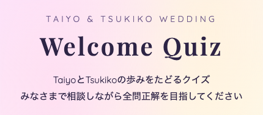

# Wedding Quiz Template

<p align="center">
  
</p>

Minimal vanilla‑JS template for running a “table quiz” during a wedding reception. Guests scan a QR code, answer curated questions, and optionally push their scores to Google Sheets through Apps Script. Everything is static and deployable to GitHub Pages.

## Demo

- https://usuginus.github.io/wedding-quiz-template/
- Shows the full flow: landing → player name entry → quiz UI → explanations → results + answer recap

## Why this project?

- **Zero backend**: just `index.html` + a tiny Apps Script endpoint.
- **Easy theming**: copy/text/questions live in a single file (`js/custom-content.js`).
- **Mobile friendly**: tuned for guests holding a phone in one hand and a drink in the other.
- **Fork‑first workflow**: clone once, tweak content per couple, redeploy.

## Architecture

```
├── index.html            # Root layout + script tags (no build step)
├── styles.css            # Global styles, gradients, responsive tweaks
├── js/
│   ├── app.js            # Quiz controller (state machine + DOM rendering)
│   ├── services.js       # Google Apps Script submission w/ retry
│   ├── config.js         # Merges defaults with user-provided copy/settings
│   └── custom-content.js # You edit this: copy, questions, settings
├── img/                  # Explanatory images for question details
├── apps-script.js        # Drop-in Apps Script handler (GET/POST/OPTIONS)
└── README.md             # This doc
```

## Quick start

1. **Fork this repo** – recommended so you can keep the upstream template up to date.
2. `git clone <your-fork>` and open the folder in your editor.
3. Double-click `index.html` or run any static server (`npx serve` etc.) to preview locally.
4. Edit `js/custom-content.js` to replace copy/questions/settings (see below).
5. Deploy your fork to GitHub Pages (`Settings → Pages → main branch / root`).

## Customizing content

Everything a couple-specific deployment needs lives in `js/custom-content.js`.

| Section                   | Description                                                                                 |
| ------------------------- | ------------------------------------------------------------------------------------------- |
| `window.WeddingCopy`      | Landing hero text, intro steps, button labels, result messages, etc.                        |
| `window.WeddingQuestions` | Array of quiz items (`text`, `choices`, `correctIndex`, optional `detail` + `detailImage`). |
| `window.WeddingSettings`  | Runtime knobs such as `APPS_SCRIPT_ENDPOINT`.                                               |

Styling tweaks go into `styles.css` (fonts, gradients, spacing). Images referenced in `detailImage.src` should be dropped in `img/`.

## Persisting scores with Google Apps Script

1. Create a Google Sheet (e.g. `Scores`) and note the spreadsheet ID.
2. From the sheet, open **Extensions → Apps Script** and paste `apps-script.js`.
3. Replace `<YOUR_SPREADSHEET_ID>` with your actual ID.
4. Deploy as a **Web App**:
   - Execute as: _Me_
   - Who has access: _Anyone_
5. Copy the resulting URL and set `window.WeddingSettings.APPS_SCRIPT_ENDPOINT` in `js/custom-content.js`.
6. Optional: for staging, you can override at runtime via `window.GOOGLE_APPS_SCRIPT_ENDPOINT`.

The client sends JSON via `fetch(..., { mode: 'no-cors' })` and retries with exponential backoff. If you skip the Apps Script URL, score submission is silently disabled.

## Deploying to guests

1. Push to your fork’s `main`.
2. Enable GitHub Pages on `main / root`.
3. Convert the published URL into a QR code (there are countless free generators).
4. Print the QR code on table tents. Guests scan, pick a representative name, and play.

## Contributing

Bug reports and PRs are welcome—especially around accessibility or translation improvements.

## License

[MIT](./LICENSE) © 2024 – use freely, just keep the notice. Forking is encouraged for each couple’s custom build.
